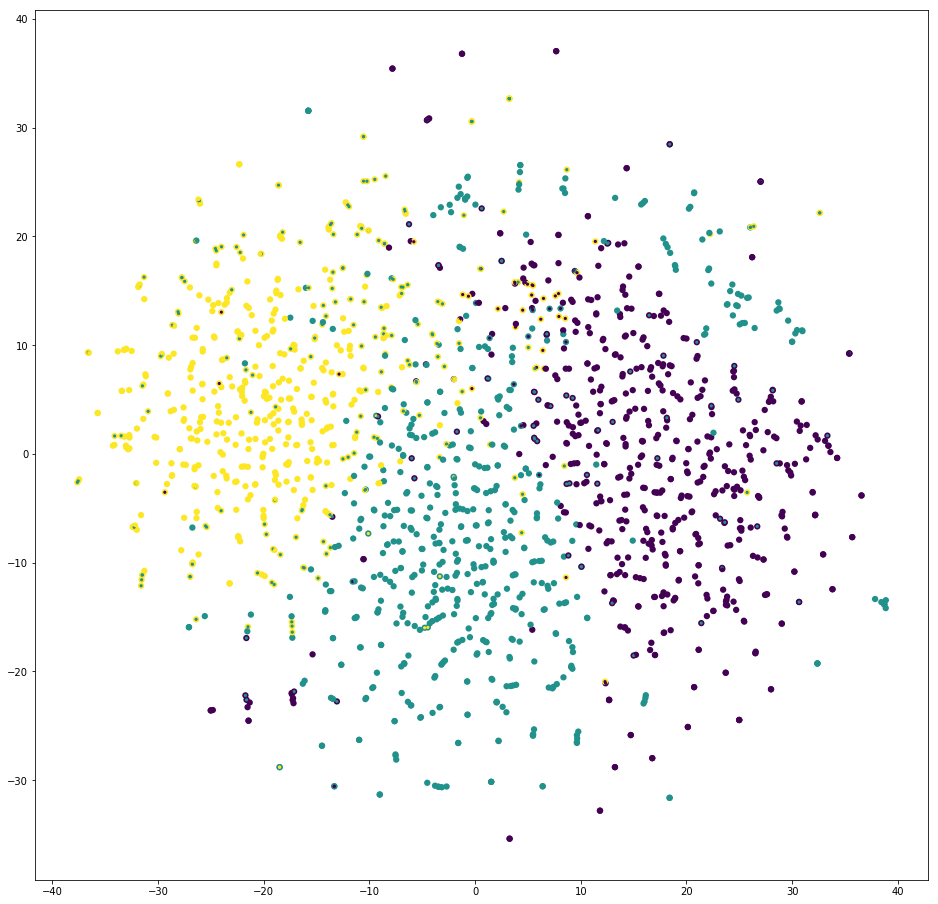

# text-clustering
### data
20newsgroups dataset
### methodology
* clustering: `KMeans` 
* features: `TfidfVectorizer` + `TruncatedSVD`
### visualisation done with [Multicore-TSNE](https://github.com/DmitryUlyanov/Multicore-TSNE)

`green` dot inside of a `yellow` one means that the clustering algorithm allocated the `yellow`-labeled example to the `green` cluster, 
thereby giving it the `green` label

### some numbers
```
got 1714 texts
num features: 2945
ratio of explained: 0.699371
in-inbetween-deviation-ratio: 4.26
```